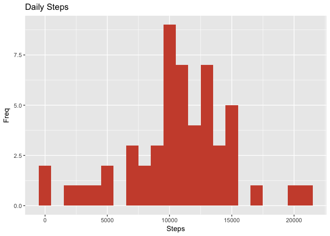
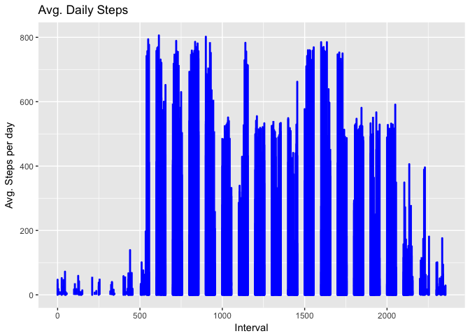
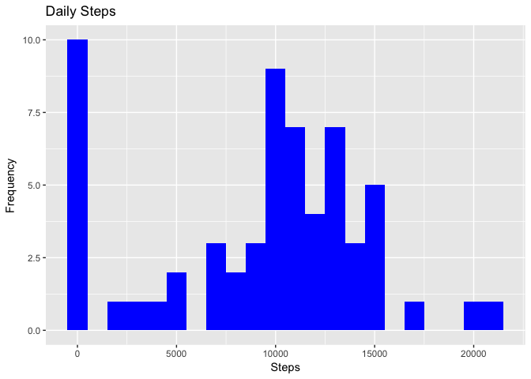
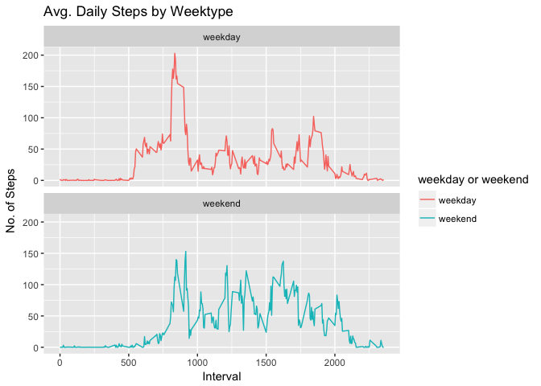

Reading in the data
-------------------

``` r
library("data.table")
library(ggplot2)
library(plotly)
```

    ## 
    ## Attaching package: 'plotly'

    ## The following object is masked from 'package:ggplot2':
    ## 
    ##     last_plot

    ## The following object is masked from 'package:stats':
    ## 
    ##     filter

    ## The following object is masked from 'package:graphics':
    ## 
    ##     layout

``` r
fileUrl <- "https://d396qusza40orc.cloudfront.net/repdata%2Fdata%2Factivity.zip"
download.file(fileUrl, destfile = paste0(getwd(), '/repdata%2Fdata%2Factivity.zip'), method = "curl")
unzip("repdata%2Fdata%2Factivity.zip",exdir = "data")
```

Reading csv Data into the data table
------------------------------------

``` r
dt <- data.table::fread(input = "data/activity.csv")
```

What is mean total number of steps taken per day?
-------------------------------------------------

1.  Calculate the total number of steps taken per day

``` r
totalSteps <- dt[, c(lapply(.SD, sum, na.rm = FALSE)), .SDcols = c("steps"), by = .(date)] 
totalSteps[, .(sumSteps = sum(steps, na.rm = TRUE))]
```

    ##    sumSteps
    ## 1:   570608

1.  Make a histogram of the total number of steps taken each day.

``` r
totalSteps <- dt[, c(lapply(.SD, sum, na.rm = FALSE)), .SDcols = c("steps"), by = .(date)]
g <- ggplot(totalSteps, aes(x = steps)) +
geom_histogram(fill = "tomato3", binwidth = 1000) +
labs(title = "Daily Steps", x = "Steps", y = "Freq")
g
```

    ## Warning: Removed 8 rows containing non-finite values (stat_bin).



1.  Calculate and report the mean and median of the total number of steps taken per day

``` r
totalSteps[, .(meanSteps = mean(steps, na.rm = TRUE),  mediaSteps = median(steps, na.rm = TRUE))]
```

    ##    meanSteps mediaSteps
    ## 1:  10766.19      10765

What is the average daily activity pattern?
-------------------------------------------

1.  Make a time series plot (i.e. 𝚝𝚢𝚙𝚎 = "𝚕") of the 5-minute interval (x-axis) and the average number of steps taken, averaged across all days (y-axis)

``` r
interval <- dt[, c(lapply(.SD, mean, na.rm = TRUE)), .SDcols = c("steps"), by = .(interval)] 

ggplot(dt, aes(x = interval , y = steps)) + geom_line(color="blue", size=1) + labs(title = "Avg. Daily Steps", x = "Interval", y = "Avg. Steps per day")
```

    ## Warning: Removed 2 rows containing missing values (geom_path).



Imputing missing values
-----------------------

1.  Calculate and report the total number of missing values in the dataset (i.e. the total number of rows with 𝙽𝙰s)

``` r
dt[is.na(steps), .N ]
```

    ## [1] 2304

1.  Devise a strategy for filling in all of the missing values in the dataset. The strategy does not need to be sophisticated. For example, you could use the mean/median for that day, or the mean for that 5-minute interval, etc.

``` r
# Filling in missing values with median of dataset. 
dt[is.na(steps), "steps"] <- dt[, c(lapply(.SD, median, na.rm = TRUE)), .SDcols = c("steps")]
```

1.  Create a new dataset that is equal to the original dataset but with the missing data filled in.

``` r
data.table::fwrite(x = dt, file = "data/tidyData.csv", quote = FALSE)
```

1.  Make a histogram of the total number of steps taken each day and calculate and report the mean and median total number of steps taken per day. Do these values differ from the estimates from the first part of the assignment? What is the impact of imputing missing data on the estimates of the total daily number of steps?

``` r
# total number of steps taken per day
Total_Steps <- dt[, c(lapply(.SD, sum)), .SDcols = c("steps"), by = .(date)] 

# mean and median total number of steps taken per day
Total_Steps[, .(Mean_Steps = mean(steps), Median_Steps = median(steps))]
```

    ##    Mean_Steps Median_Steps
    ## 1:    9354.23        10395

``` r
ggplot(Total_Steps, aes(x = steps)) + geom_histogram(fill = "blue", binwidth = 1000) + labs(title = "Daily Steps", x = "Steps", y = "Frequency")
```



Are there differences in activity patterns between weekdays and weekends?

1.  Create a new factor variable in the dataset with two levels – “weekday” and “weekend” indicating whether a given date is a weekday or weekend day.

``` r
# Just recreating dt from scratch then making the new factor variable. 
dt <- data.table::fread(input = "data/activity.csv")
dt[, date := as.POSIXct(date, format = "%Y-%m-%d")]
dt[, `Day of Week`:= weekdays(x = date)]
dt[grepl(pattern = "Monday|Tuesday|Wednesday|Thursday|Friday", x = `Day of Week`), "weekday or weekend"] <- "weekday"
dt[grepl(pattern = "Saturday|Sunday", x = `Day of Week`), "weekday or weekend"] <- "weekend"
dt[, `weekday or weekend` := as.factor(`weekday or weekend`)]
head(dt)
```

    ##    steps       date interval Day of Week weekday or weekend
    ## 1:    NA 2012-10-01        0      Monday            weekday
    ## 2:    NA 2012-10-01        5      Monday            weekday
    ## 3:    NA 2012-10-01       10      Monday            weekday
    ## 4:    NA 2012-10-01       15      Monday            weekday
    ## 5:    NA 2012-10-01       20      Monday            weekday
    ## 6:    NA 2012-10-01       25      Monday            weekday

1.  Make a panel plot containing a time series plot (i.e. 𝚝𝚢𝚙𝚎 = "𝚕") of the 5-minute interval (x-axis) and the average number of steps taken, averaged across all weekday days or weekend days (y-axis). See the README file in the GitHub repository to see an example of what this plot should look like using simulated data.

``` r
dt[is.na(steps), "steps"] <- dt[, c(lapply(.SD, median, na.rm = TRUE)), .SDcols = c("steps")]
interval <- dt[, c(lapply(.SD, mean, na.rm = TRUE)), .SDcols = c("steps"), by = .(interval, `weekday or weekend`)] 

ggplot(interval , aes(x = interval , y = steps, color=`weekday or weekend`)) + geom_line() + labs(title = "Avg. Daily Steps by Weektype", x = "Interval", y = "No. of Steps") + facet_wrap(~`weekday or weekend` , ncol = 1, nrow=2)
```


